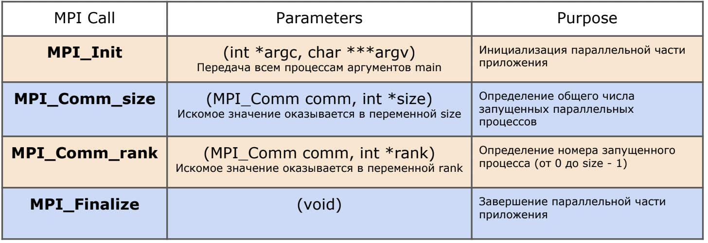

# Семинар №1

---

## Введение в MPI

---

### Историческая справка

Коммуникационный протокол, независимый от языка программирования, который
используется для программирования параллельных компьютеров (кластеры и
суперкомпьютеры).  
* 1991 - начало разработки MPI  
* ноябрь 1993 - проект стандарта MPI представлен на конференции “Supercomputing’93”  
* июнь 1994 - выпуск версии MPI 1.0  
* ...  
* 2012 - MPI 3.0  
* 2019 - MPI 4.0  

Интерфейс стал де-факто стандартом для связи процессов при работе параллельной
программы на системе с распределённой памятью.

### Параллельные и распределенные вычислительные системы

__Параллельные__:
* многократное ускорение
* высокопроизводительные машины
* *отказоустойчивости нет
* с точки зрения разработчика -- набор взаимодействующих процессов

__Распределенные__:
* большие объёмы данных
* обычные машины
* отказоустойчивость
* с точки зрения разработчика -- одно распределенное вычислительное устройство

### MPI программа на С/С++

Реализация MPI-функций лежит в заголовочном файле ```mpi.h```.
Зона параллельной части программы находится между вызовами функций ```MPI_Init``` и ```MPI_Finalize```.
Чтобы получить количество процессов, используется ```MPI_Comm_size```. Определить id процесса среди N запущенных 
можно через ```MPI_Comm_rank```.



Коммуникаторы -- некое абстрактное объединение множества процессов (на самом деле области связи над группами процессов).
В рамках курса нам достаточно использовать ```MPI_COMM_WORLD```.

Пример программы, выполняющей ```"Hello, World!"``` на каждом процессе и считающей количество процессов:
```c
#include <stdio.h>
#include <mpi.h>

int main(int argc, char *argv[]) {
    MPI_Init(&argc, &argv);
    
    int procid, num_procs;
    MPI_Comm_rank(MPI_COMM_WORLD, &procid);
    MPI_Comm_size(MPI_COMM_WORLD, &num_procs);
    
    char processor_name[MPI_MAX_PROCESSOR_NAME];
    int name_length;
    MPI_Get_processor_name(processor_name, &name_length);
    
    printf("Hello, World! My id is %d and my processor name is %s\n", procid, processor_name);
    
    if (procid == 0) {
        printf("All processes count: %d\n", num_procs);
    }
    
    MPI_Finalize();
    return 0;
}

```

### Компиляция MPI программы на С/С++

Компиляция программ происходит при помощи компиляторов ```mpicc``` и ```mpic++```. Подключение происходит при помощи команды

```[bash]
module add mpi/openmpi4-x86_64
```

После этого ```mpicc``` и ```mpic++``` подгрузятся в `$PATH` и можно:

```[bash]
mpicc <FILE_NAME>.c
```

```[bash]
mpic++ <FILE_NAME>.cpp
```


### Запуск программ MPI локально

_Инструкция ниже подходит для запуска на пользовательских машинах и на клиенте кластера_

Для локального запуска можно использовать скрипт:
```bash
#!/bin/bash
mpiexec -np 4 ./a.out
```

Опция ```-np (-c|-n|-np|--np <arg0>)``` используется для указания количества процессов.

MPI локально может быть установлен для следующих ОС (на кластере уже есть):

Ubuntu: `sudo apt-get install openmpi-bin libopenmpi-dev`

Mac OS: `brew install open-mpi`

### Команды по использованию SLURM

* `sinfo` - посмотреть информацию по нодам кластера
* `sinfo -N -l` - посмотреть информацию по каждой ноде кластера
* `squeue` - посмотреть очередь задач
* `srun <command>` - запустить команду на ноде кластера
* `sbatch <script>` - запустить скрипт на нодах кластера. Каждый скрипт должен начинаться с `#!/bin/bash`.
  После этого должно высветиться сообщение `Submitted batch job <job_id>`, результаты работы попадают в лог-файл `slurm-<job_id>.out`.

### Запуск программ MPI на кластере

Чтобы отправить задачу в очередь на Slurm (ресурсный менеджер кластера):
```bash
sbatch -n <NUM_OF_PROCESSES> ./run.sh
```

или с помощью sbatch-файла ```run_sbatch_config.sh```, который имеет вид:

```bash
#!/usr/bin/env bash
#
#SBATCH --ntasks=8
#SBATCH --cpus-per-task=1
#SBATCH --job-name=my_job
#SBATCH --output=out.txt
#SBATCH --error=error.txt
mpiexec ./a.out
```
```bash
sbatch ./run_sbatch_config.sh
```


### Полезные ссылки:
* [Mануал OpenMPI 4.0](https://www.open-mpi.org/doc/current/)
* [Tutorial по MPI с примерами](https://mpitutorial.com)
* [Примеры работы с sbatch в bash](https://hpc-uit.readthedocs.io/en/latest/jobs/examples.html)
* [Python-клиент для работы с sbatch](https://github.com/luptior/pysbatch)
* [Python-библиотека для разработки MPI программ](https://mpi4py.readthedocs.io/en/stable/intro.html)


