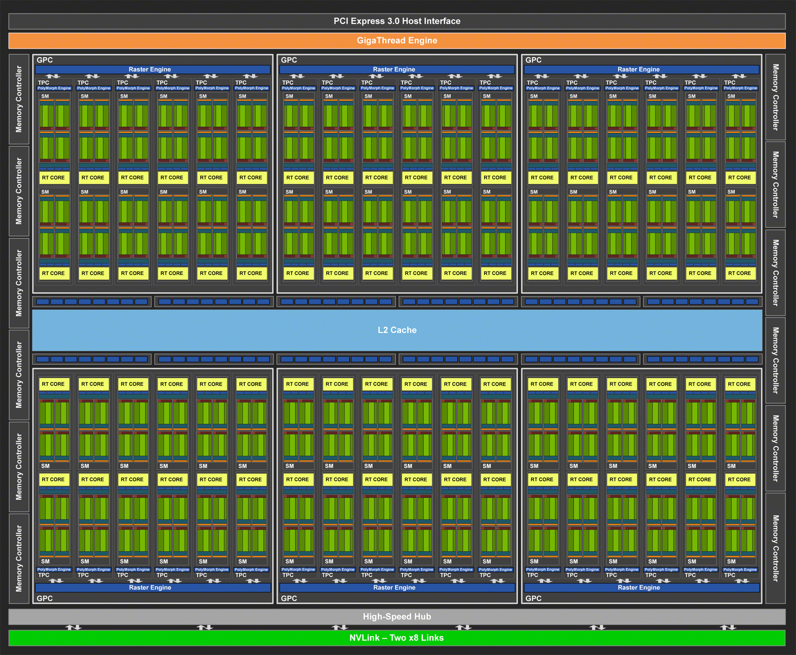

# Идея

## Мотивашка

На прошлых занятиях мы рассматривали механизмы распараллеливания процессов за счёт их копирования либо за счёт создания множества потоков и задач для них (тасков). Однако - из предыдущих задач можно сделать одно интересное наблюдение - с 80% тасок или процессов делают примерно одно и тоже по одним и тем же инструкциям, но только с разными ячейками памяти. Однако, ядра процессоров, выполняющие такие инструкции способны на гораздо большее - решать совершенно другую задачу с другими инструкциями. К примеру одно ядро занимается просчётом физики в компьютерной игре, другое же занимается обсчётов звукового окружения, или симуляцией вселенной. В общем, в задачах где мы пользуемся идентичными инструкциями кажется, что такие возможности процессора не требуются.

Именно в этот момент и появились видеокарты, или как их ещё называют, видеоускорители или графический процессорный (u)юнит. Первоначальной их целью было вычисление по одной инструкции большого массива данных о картинке. Но потом ушлые программисты осознали, что использовать их можно не только для красивых картинок, но и для просто быстрых вычислений. Так появилось понятие GPGPU и его представитель CUDA.

## О чём это

В общем CUDA позволяет довольно просто и без созданий костылей отдавать на видеокарту вычислительную задачу в виде небольшой подпрограммы, а так же работать с памятью видеокарты. Однако там имеется множество подводных камней, так как передача данных на ядра довольно не тривиальна. С другой стороны, за счёт сокращения "расходов площади" на сложные конвейры вычислений и создании планировщика, который раздаёт инструкции сразу множеству ядер, мы получаем существенный прирост в количестве вычислительных ядре, а вместе с этим и в производительности. Собственно сейчас и выясним, на сколько всё стало работать быстрее.

# Пробы

## Залетаем на кластер

Как вам должны были сказать, для работы на видеокартах мы будем пользоваться другим кластером - **lorien**. Если точнее `lorien.atp-fivt.org` или `93.175.29.112` . На почту вам аналогично предыдущим семинарам должны были придти явки и пароли. По аналогии с calc заходим на кластер и радуемся.

Если забыли как - копируем команду начиная с ssh в консоль/терминал, вводим пароль и попадаем на кластер.

*Чутка справки* - lorien на самом деле не кластер, но одна серверная машина с 8 установленными в неё видеокартами 2080 Ti. Можете убедиться в этом запустив команду `nvidia-smi -L`

Более того, хочу обрадовать. В отличие от calc, кластер lorien *поддерживает возможность использования ssh ключей*, то есть теперь можно заходить на кластер без пароля. Если не знаете как это делается - советую отправится в гугл (пока не запрещённая на территории России организация) и выяснить, будет полезно.

## Придумаем задачу

Итак, для начала, чтобы осознать ускорение в задачах, надо сделать сами задачи - не буду греха таить, возьмём код у лектора

[Оригинал](https://github.com/akhtyamovpavel/ParallelComputationExamples/blob/master/CUDA/01-intro/00-hello-world-single-thread/main.cpp)
```c++
#include <iostream>
#include <cmath>

void add(int n, float* x, float* y) {
	for (int i = 0; i < n; ++i) {
		y[i] = x[i] + y[i];
	}	
}


int main() {
	int N = 1 << 28;
	float* x = new float[N];
	float* y = new float[N];

	for (int i = 0; i < N; ++i) {
		x[i] = 1.0f;
		y[i] = 2.0f;
	}

	add(N, x, y);
	
	float maxError = 0.0f;
	for (int i = 0; i < N; i++) {
		maxError = fmax(maxError, fabs(y[i]-3.0f));
	}
	std::cout << "Max error: " << maxError << std::endl;
	delete [] x;
	delete [] y;
	return 0;
}
```

и запишем его прямо в файл hello.cpp. В принципе, рекомендую сразу скопировать себе репозиторий с примерами кода через git clone, так как мы будем использовать их, в дальнейшем я не буду называть файлы, куда мы будем копировать примеры, а просто предоставлять кусок нового кода и ссылку на оригинал.

Если в краце по коду - мы создаём 2 массива float, элементы первого из которых равны 1.0, второго 2.0. Затем с помощью функции add мы их складываем поэлементно и проверяем, что в результирующем массиве значения равны 3.0 . На вывод идёт величина ошибки (в идеале, да и в целом должно быть 0)

Запускаем код как обычно через

```
g++ hello.cpp
time ./a.out
```

Команда time позволит нам запомнить время работы программы

## Первые попытки

### Пуск

Хорошо, теперь попробуем использовать CUDA:

```c++
#include <iostream>
#include <cmath>

__global__
void add(int n, float* x, float* y) {
	for (int i = 0; i < n; ++i) {
		y[i] = x[i] + y[i];
	}	
}


int main() {
	int N = 1 << 28;
	float *x, *y;

    cudaSetDevice (5);

	cudaMallocManaged(&x, N * sizeof(float));
	cudaMallocManaged(&y, N * sizeof(float));


	for (int i = 0; i < N; ++i) {
		x[i] = 1.0f;
		y[i] = 2.0f;
	}

	add<<<1, 1>>>(N, x, y);

	cudaDeviceSynchronize();	
	float maxError = 0.0f;
	for (int i = 0; i < N; i++) {
		maxError = fmax(maxError, fabs(y[i]-3.0f));
	}
	std::cout << "Max error: " << maxError << std::endl;

	cudaFree(x);
	cudaFree(y);
	return 0;
}
```

Код сохраняем в файл hello.cu, не cpp. Программы для cuda имеют слегка иной синтаксис.

**Для компиляции кода используем специальный компилятор**
```
nvcc hello.cu
```

Получив любимый a.out, запускаем его и ждём... ждём... и ура, получаем результат так же 0 ошибок. Однако по ощущениям пришлось ждать довольно долго, даже дольше чем при запуске на процессоре. Почему?

Давайте разбирать по ходу кода - на самой первой строчке, в объявлении функции встречаем неожиданный макрос - **\_\_global__**.
- **\_\_global__** - Это спецификатор того, для каких целей предназначается эта функция. В данном случае мы говорим, что такая программа будет выполняться на GPU, а запуск её будет произведён с CPU.
- Есть ещё и **\_\_device__**, которая означает запуск функции через другую функцию, выполняющуюся на GPU, но в целом можно использовать и global.

Смотрим далее и видим обычную функцию сложения, ничего нового. Идём в main и сразу видим:

- `cudaSetDevice (5)` - Если кратко, то это выбор на какой видеокарте мы будем выполнять расчёт. По хорошему можно спроектировать приложение так, чтобы оно обсчитывалось на нескольких видеокартах, но это уже за рамками курса. Почему именно 5ая? А чтобы остальным не мешать.

В целом можете попробовать выполнить команду `nvidia-smi` и увидеть, что какие то видеокарты заняты, а какие то простаивают (можно смотреть и по памяти и по загруженности). Именно от этого факта и отталкивайтесь, когда выбираете карту для расчётов. Можно так же запустить такой код с командой watch - `watch -n 0.1 nvidia-smi`, чтобы просматривать работы видеокарт в реальном времени.

- `cudaMallocManaged (void* array, size_t size)` - буквально говорим CUD'e, что мы хотим, чтобы копия этого массива оказалась и на видеокарте. То есть мы помечаем память как рассшаренную между CPU и GPU и будем пользоваться ей, будто она выделена и там и там. Здесь стоит сказать, что у видеокарт (не встроенных в CPU) есть своя память на борту, которая к тому же быстрее, нежели память CPU. Но, к сожалению, перед работой с ней требуется сначала скопировать данные в память видеокарты. Ну или считать их в конце

- `add<<<Grid_size, Block_size>>> (N, x, y)` - Важно здесь не само название функции, а то, что мы вызываем её с неожиданным синтаксисом `<<<Grid_size, Block_size>>>`. И вот тут, к сожалению, коротким абзацем не отделаешься. Об этом чуть ниже

- `cudaDeviceSynchronize()` - синхронизация ядер и потоков между собой, чтобы дождаться завершения работы оных и быть уверенным, что в памяти уже записаны все результаты

- `cudaFree(x)` - по аналогии с malloc освобождение памяти на видеокарте после вычислений. Как минимум - правило хорошего тона.

### Экскурс в грядки (Grid и Block)

Для начала напомню, что на видеокартах мы собирались экономить за счёт того, чтобы заставить её разные части выполнять одну и ту же чёрную простую работу. Так вот, давайте глянем глазком на архитектуру видеокарты:


Упс, не то



Как видите, у нас здесь присутствует какое то огромное количество мелких компонент. Сразу бросается в глаза L2 кэш, но он не нужен нам. Обратим внимание на зелёные кубики. Если присмотреться, то каждый из них подписан как SM процессор. Это по факту - основные ядра видеокарты. И да, их много. Прям много. Но это ещё не всё.


Каждый SM процессор так же состоит из 4 блоков и L1 кэша, а каждый блок ещё состоит из 34 компонент, 2 тензорных ядра, 16 для целочисленных вычислений и 16 для вычислений с плавающей точкой. Правда, компоненты для вычислений целых чисел и с плавающей точкой отвечают за разные задачи, так что можно их считать как 1 компоненту. В общем, такие блоки называются варпами (можно увидеть надпись warp scheduler - компонента, которая управляет частями варпа). Эти маленькие блоки внутри варпа - микроядра, которы и проводят вычисления. Можно даже подсчитать сколько их в итоге:

68 SM процессоров \* 4 варпа \* 16 ядра в каждом = 4352. Причём для целых чисел и ещё столько же для чисел с плавающей точкой. Это точно не сравниться с 8 ядрами вашего процессора.

Но тогда встаёт другой вопрос - чем именно мы пожертвовали для возможности разместить на чипе такое огромное число ядер? Ответ - инструкциями. Каждый SM процессор снаружи воспринимается как единая вычислительная единица, то есть все 4 варпа работают как одно целое. Более того, с точки зрения логики, у нас не 4, а только 2 варпа, на каждый из которых приходится по 32 вычислительных потока. Зачем так группировать? Потому что есть ещё одно важное ограничение - на каждый Логический варп за такт времени приходит единый подряд идущий блок данных.

Если по простому, то представьте порт с нумерованными контейнерами. Этот порт - оперативная память, которая отсылает данные на ядра для вычислений. Так вот, администрация этого порта настолько "простая", что может в корабль уложить только 32 подряд идущих контейнера. И именно в таком виде они отправляются к ядрам варпа.

То есть если 1 ядро варпа запрашивает ячейку номер 54, то остальные ядра начиная со второго получат 55, 56, 57 соответственно контейнеры памяти (ячейки) и так далее до 32 ядра. Чтобы 2 ядро получило доступ к данным ячейки к примеру 120, ему придётся дождаться следующего прибытия данных, причём в этом случае остальные ядра так же получат данные, лежащие по соседству. Такова цена увеличения количества ядер.

Это довольно сложно понять сразу, поэтому будет осознавать это постепенно на примерах.

Но вернёмся к понятиям **Grid_size** и **Block_size**. Так вот, вспоминаем - у нас есть SM процессор, у которого 64 микроядра для вычислений. И вспоминаем OpenMP, в котором можно было разбивать код на таски, становящиеся в очередь на выполнение потоками. Здесь будем действовать по аналогии - создадим логическую единицу **Block** - это таска, которая становится в очередь на выполнение SM процессором. То есть Блоки, это логически пакеты задач, которые берут на себя SM процессоры из стека. Такой стек и называется **Grid**. В общем

**Block** - логический пакет задач, который выполняется одним SM процессором
**Grid** - Стек блоков, из которого они и распределяются по видеокарте

Что интересно - блоки и гриды могут быть 2х и 3х мерными. Физически это мало что меняет, но добавляет целый ряд удобств для работы с многомерными данными (а видеокарты обычно работают с 3D пространством)

И теперь можно до конца осознать, что же значат Grid_size и Block_size

**Block_size** - количество подзадач внутри блока, которые и будут выполнены на микроядрах SM процессора
**Grid_size** - количество блоков, которые будут созданы планировщиком для вычислений

Осталось лишь понять, как именно распределяются подзадачи блока по микроядрам SM процессора. И тут всё довольно просто - блок разбивается по группам в 32 подзадачи, а потом каждая группа отправляется в один из варпов на вычисление. Причём суммарное количество подзадач может быть больше количества варпов*32. Они просто встанут в очередь.

Для тех, кто ещё не достиг катарсиса - то, что мы писали до этого как global функцию и есть подзадача, которая распространиться на ядра видеокарты.

### Вторая попытка, расширяем блок

Итак, мы вроде осознали, что 2 параметра в <<<>>> и означали количество потоков, на которое мы распределяем задачу. Давайте пробовать ускорять её.

```c++
#include <iostream>
#include <cmath>

__global__
void add(int n, float* x, float* y) {
	int index = threadIdx.x;
	int stride = blockDim.x;

	for (int i = index; i < n; i += stride) {
		y[i] = x[i] + y[i];
	}	
}


int main() {
	//same

	add<<<1, 256>>>(N, x, y);

	//same
}
```

Исходник [тут](https://github.com/akhtyamovpavel/ParallelComputationExamples/blob/master/CUDA/01-intro/02-add-threads/main.cu)

Как видим, тут добавился размер блока в 256 элементов. Что это значит? Что задача add будет выполнена на одном SM процессоре на всех 64 вычислительных микроядра 4 раза (так как подзадач 256, а вычислителей только 64). А теперь так же заметьте - у нас изменилась функция add. Теперь здесь не цикл по всему массиву, а цикл по элементам, номера которых кратны номеру потока в блоке (если что, эти номера логические и измеряются от 0 до block_size-1).

Собственно вопрос на понимание событий с памятью - почему каждый поток не считает данные подряд по типу a[0]+a[1]+a[2], разбив массив на block_size блоков?

<details>
  <summary>Ответ</summary>

Как и было в объяснении - память поставляется из L2 кэша по контейнерам подряд идущей памяти. То есть на варп, первый поток которого запросил 50 элемент массива, придут 50,51,52,53 и т.д. элементы.

Если мы будем запрашивать потоками данные, которые идут подряд (разбивая массив на равные куски по block_size), то появится эффект очереди - сначала на варп придёт набор данных с элементом 0, потом для 1 потока придут данные с элементом g, где g - первый элемент второго блока массива, потом придут данные с элементом g+g для 3 потока и так далее. Получается, что у нас простаивают потоки, ожидая данные для себя, что сильно не эффективно. (Хотя оптимизация кэшем скорее всего позволит сначала первому потоку сразу 32 элемента вычислить, но это всё равно не параллельно)

Тем самым, для решения такой проблемы, мы постараемся заставить потоки обращаться только к памяти, которая им сейчас доступна, а не что было бы нам удобно. И в таком случае как раз получаем, что каждый поток получает ячейку памяти, равную его номеру по модулю размера блока. Или проще, каждый поток будет итерироваться со сдвигом в размер блока.

</details>

Итак, пробуем запускать и.. получаем скорость! Ну почти, если сравнивать предыдущим вариантом с использованием функции `time`, то мы получили припрост скорости примерно в 6 раз (26 секунд против 4). Стандартный код на CPU всё ещё быстрее - 3 секунды, но как минимум у нас теперь есть ещё одно вычислительное устройство, которое работает параллельно CPU с той же скоростью, уже не плохо)

Но, как вы понимаете, этого сильно мало. В этот момент вспоминаем, что у нашей видеокарты не 1 SM процессор, обрабатывающий блок, а как минимум 68! Надо пользоваться, как по мне.

### Третья попытка, многоблочность!

В краце, теперь укажем видеокарте, что у нас не 1 блок, а огромное множество. Буквально они покрывают весь массив. Что это значит? Что теперь у нас в планировщике есть блоки-таски, и внутри каждой есть подзадачи, каждая из которых будет вычислять ровно один элемент из массива, причём уникальный, и этих подзадач в сумме будет ровно (с запасом) по размеру массива.

Для начала надо поправить вызов функции. Чтобы вычислить, сколько блоков надо (с запасом) просто берём и делим размер массива на размер блока, ну и добавляем чуть сверху в случае, если оно целиком не влезает

```c++
	int blockSize = 256;

	int numBlocks = (N + blockSize - 1) / blockSize; // деление с округлением вверх

	add<<<numBlocks, blockSize>>>(N, x, y);
```

Отлично. Однако, у нас всё ещё старое ядро. Если мы с ним запустим, то мы получим неверный ответ (причём он будет больше в numBlocks раз). А ещё и скорости не прибавим, можете проверить. Значит меняем ядро! В этот моменте стоит вспомнить, что теперь у нас на каждый элемент массива существует своя собствення подзадача из всего пула. А раньше, если посмотреть на старое ядро

```c++
__global__
void add(int n, float* x, float* y) {
	int index = threadIdx.x;
	int stride = blockDim.x;

	for (int i = index; i < n; i += stride) {
		y[i] = x[i] + y[i];
	}	
}
```

Можно заметить, что мы в каждую подзадачу закладывали то, что она будет просчитывать целый кусок массива по элементам, лежащим друг от друга на расстоянии stride (в принципе, именно столько подзадач у нас раньше и было в распоряжении). Теперь же, раз наших подзадач стало больше, то можно и увеличить stride - до их нового количества

```c++
__global__
void add(int n, float* x, float* y) {
	int index = blockIdx.x * blockDim.x + threadIdx.x;
	int stride = blockDim.x * gridDim.x;

	for (int i = index; i < n; i += stride) {
		y[i] = x[i] + y[i];
	}	
}
```

Можно пробовать запускать и смотреть на результат работы. И в итоге получаем почти тоже время. То есть никакого ускорения? - Не совсем, проблема в том, что мы не эффективно копируем на GPU память. То есть механизмы cudaMallocManaged периодически производят синхронизацию памяти между видеокартой и оперативкой, что сильно замедляет процесс вычислений, так как происходит простаивание.

### Отшлифовка экспериментов

Для проверки гипотезы, что разница маленькая из-за копирования памяти с GPU и на неё, можем провести эксперимент - добавить сложности в вычисления, не зависящей от памяти. Причём всё довольно просто - добавим в ядра огромный цикл, который будет вычислять сумму этих 2 элементов 1'000 раз и посмотрим теперь на время работы.

Для второго примера:

```c++
__global__
void add(int n, float* x, float* y) {
	int index = threadIdx.x;
	int stride = blockDim.x;
	int sum = 0;

	for (int i = index; i < n; i += stride) {
		for (int j = 0; j < 1'000; j++ )
			sum+= x[i] + y[i];

		y[i] = sum;
	}
}
```

Для третьего примера новое ядро:
```c++
__global__
void add(int n, float* x, float* y) {
	int index = blockIdx.x * blockDim.x + threadIdx.x;
	int stride = blockDim.x * gridDim.x;
	int sum = 0;

	for (int i = index; i < n; i += stride) {
		for (int j = 0; j < 1'000; j++ )
			sum += x[i] + y[i];

		y[i] = sum;
	}
}
```

В итоге можем заметить, что второй пример замедлился раз в 5-6, в то время как третий пример выдал те-же результаты по времени. Отсюда можно сделать вывод, что нам хватает вычислительных мощностей и замедление происходит в ином месте.

### Четвёртая попытка, память

Давайте тогда попробуем решить проблему с копированием памяти, хотя бы частично.

С правильным алгоритмом работы с cudaMallocManaged я к сожалению вас не познакомлю. Но зато можно заменить его на кое что более детерминированное и простое и за счёт этого получить ускорение.

В CUDA есть функция `cudaMalloc`

- плюсы: Она копирует память сразу всю и не пытается синхронизировать данные в оперативной памяти процессора с данными на видеокарте
- минусы: Придётся напрямую заняться синхронизацией, то есть буквально копировать данные с видеокарты и обратно командами

Для копирования данных нам потребуется функция `cudaMemcpy(Target, Source, size, cudaMemcpyHostToDevice/cudaMemcpyDeviceToHost)`

- target - адрес памяти, куда копируются данные
- source - адрес памяти, откуда копируются данные
- size - количество данных в **байтах**
- cudaMemcpyHostToDevice/cudaMemcpyDeviceToHost - две константы, которыми определяется направление работы функции

Тогда давайте изменим main, оставив наше ядро аналогичным

```c++
int main() {
	int N = 1 << 28;
	size_t size = N * sizeof(float); // размер массивов в байтах
	float *d_x, *d_y;
	float *h_x, *h_y;

	cudaSetDevice (5);

	// выделения памяти на CPU и GPU
	h_x = (float*)malloc(size);
	h_y = (float*)malloc(size);
	cudaMalloc(&d_x, size);
	cudaMalloc(&d_y, size);


	for (int i = 0; i < N; ++i) {
		h_x[i] = 1.0f;
		h_y[i] = 2.0f;
	}


	cudaMemcpy(d_x, h_x, size, cudaMemcpyHostToDevice);// копирование массива h_x в d_x
	cudaMemcpy(d_y, h_y, size, cudaMemcpyHostToDevice);// копирование массива h_y в d_y

	int blockSize = 256;

	int numBlocks = (N + blockSize - 1) / blockSize;

	add<<<numBlocks, blockSize>>>(N, d_x, d_y);

	//cudaDeviceSynchronize();	
	cudaMemcpy(h_y, d_y, size, cudaMemcpyDeviceToHost); // копирование массива d_y в h_y

	float maxError = 0.0f;
	for (int i = 0; i < N; i++) {
		maxError = fmax(maxError, fabs(h_y[i]-3.0f));
	}
	std::cout << "Max error: " << maxError << std::endl;

	cudaFree(d_x);
	cudaFree(d_y);
	free(h_x);
	free(h_y);
	return 0;
}
```

Как видим, одно из главных изменений - теперь мы отдельно выделяем память на CPU и на GPU. **Важно** - мы выделяем память в байтах, как в принципе и с помощью обычного malloc. А так же, теперь нужно переносить данные из одной памяти в другую, чем мы и занимаемся в 3 вызовах cudaMemcpy. И как обычно, в конце теперь нам придётся освобождать и память CPU и память GPU.

Итак, запускаем, смотрим... и снова никакого эффекта, время не уменьшилось в рамках погрешности. Однако, это было не зря, так как теперь мы можем использовать функцию `nvprof`. Это профилировщик, который поможет нам оценить время, затраченное каждой функцией.

После компиляции прямо запускаем

```
nvprof ./a.out
```

И смотрим на затраченное время. Особенно советую обратить внимание на время, затраченное на копирование данных на GPU и копирование данных обратно. Оно будет примерно 95-98% времени общей работы. Само ядро же будет отрабатывать только около 5 ms (без мусорного цикла для загрузки). В общем, отсюда крайне рекомендую извлечь один важный момент - перед вычислениями стоит копировать данные целиком и стараться не трогать их, так как это относительно дорогая операция.

## Замеры времени

В д/з, да и по жизни, придётся считать время работы программы. Можно это делать *nvprof*, но такое себе. Поэтому мы изучим, как CUDA может замерять время работы программы. Механизм довольно не тривиален, но в целом очень похож на подобные.

Давайте пройдёмся по существующим для этого функциям, а как их вместе собрать думаю сумете придумать (ну или подсмотрите)

- `cudaEvent_t start` - создаёт переменную, где будет хранится замер времени в определённый момент... собственно времени. В общем это аналог timestamp, который хранит время, прошедшее с некоторого момента (момент всегда для всех одинаковый). Однако хранит она это время по особенному, так как процессы асинхронны, и их тысячи.

- `cudaEventCreate(&start)` - здесь инициализируем переменную событий, тонко намекая CUD'e, что мы хотим сделать.

- `cudaEventRecord(start)` - записывает текущий момент времени в переменную start

- `cudaEventSynchronize(stop)` - вот тут и начинаются отличия. Так как у нас почти все операции и ядра асинхронны, то требуется дождаться, пока все вычисления закончатся. В итоге, после записи временной метки, нам ещё требуется выровнять её по последнему потоку, который закончил вычисления. Именно этим и занимаемся)

- `cudaEventElapsedTime(&milliseconds, start, stop)` - после создания timestamp, нужно превратить их в миллисекунды времени. То есть тут мы записываем в milliseconds время, прошедшее с момента start до момента stop.

В общем пробуем

```c++
int main() {
	int N = 1 << 28;
	size_t size = N * sizeof(float);
	float *x = (float*)malloc(size);
	float *y = (float*)malloc(size);

	float *d_x, *d_y;

	cudaMalloc(&d_x, size);
	cudaMalloc(&d_y, size);


	for (int i = 0; i < N; ++i) {
		x[i] = 1.0f;
		y[i] = 2.0f;
	}


	cudaMemcpy(d_x, x, size, cudaMemcpyHostToDevice);
	cudaMemcpy(d_y, y, size, cudaMemcpyHostToDevice);

	int blockSize = 256;

	int numBlocks = (N + blockSize - 1) / blockSize;

    cudaEvent_t start;
    cudaEvent_t stop;

    // Creating event
    cudaEventCreate(&start);
    cudaEventCreate(&stop);


    cudaEventRecord(start);
	add<<<numBlocks, blockSize>>>(N, d_x, d_y);

    cudaEventRecord(stop);

	cudaMemcpy(y, d_y, size, cudaMemcpyDeviceToHost);
    //cudaEventRecord(stop);
    cudaEventSynchronize(stop);
    
    float milliseconds = 0;

    cudaEventElapsedTime(&milliseconds, start, stop);

    std::cout << milliseconds << " elapsed" << std::endl;

	cudaFree(d_x);
	cudaFree(d_y);
	free(x);
	free(y);
	return 0;
}
```

Запускаем и смотрим результат - на выход мы получили те самые 5 мс, которые и видели в профилировщике. А большего и не надо)