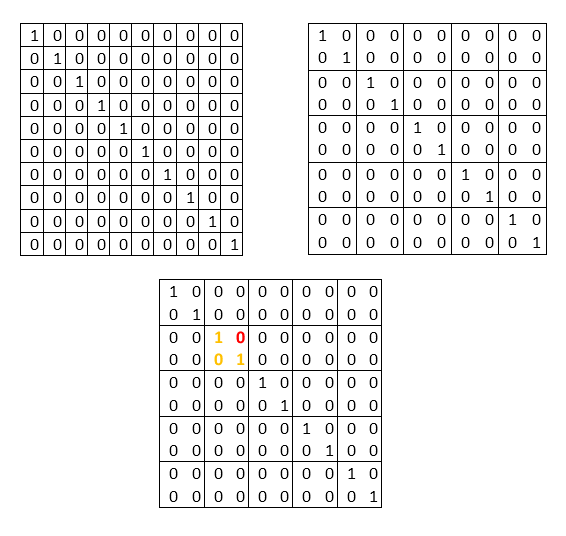
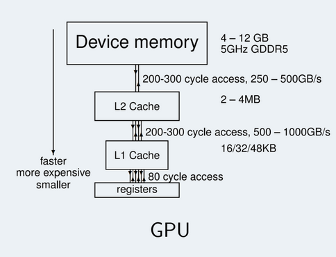
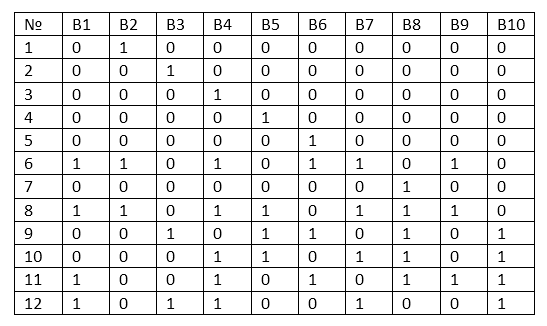

# Shared memory, ILP и другие

## Многомерные ядра и блоки

Как вы помните с прошлого семинара, для отправки задач на видеокарту CUDA создаёт блоки подзадач, каждая из которых выполняется на микроядре SM процессора. В специальных параметрах запуска мы определяли, сколько блоков будем создавать (В Grid'e) и сколько подзадач в каждом блоке. И так же упоминали, что возможно ещё делать и Grid и Блоки многомерными.

Так вот, сейчас и испробуем эту самую многомерность. И конечно же на матрицах.

Для начала напишем вспомогательный код для матриц

```c++
#include <iostream>

#define BLOCK_SIZE 256


void FillMatrix(float* matrix, int height, int width) {
	for (int i = 0; i < height; ++i) {
		for (int j = 0; j < width; ++j) {
			if (i == j) {
				matrix[i * width + j] = 1;
			} else {
				matrix[i * width + j] = 0;
			}
		}
	}
}

void PrintMatrix(float *matrix, int height, int width) {

	for (int i = 0; i < height; ++i) {
		for (int j = 0; j < width; ++j) {
			std::cout << i << " " << j << " " << matrix[i * width + j] << "\n";
		}
	}
}
```
В краце - первая генератор диагональных матриц. Вторая - просто печать матрицы по координатам

Далее, для создания многомерных блоков или гридов используется специальная переменная `dim3`. Тогда объявления 3-х мерных (или 2-х мерных в нашем случае) грида и блока будет примерно таким

```c++
dim3 num_blocks(8, 16);
dim3 block_size(16, 16);
```

Где в скобочках указаны размеры и блока и грида. Внимание, для блока всё так же действует ограничение, что суммарное количество потоков  в нём не превышает 1024. То есть не получится создать блок размера 32\*32\*32, так как это 32'768 попугаев. Кстати, третья размерность так же не может быть больше 64. Получаем, что **максимальные размерности блока** (не путать с размером!) 1024\*1024\*64.

Запишем целиком получившийся main

```c++
int main() {

	float *h_A;
	float *h_B;
	float *h_C;

	h_A = new float[128 * 384];
	h_B = new float[384 * 256];
	h_C = new float[128 * 256];

	FillMatrix(h_A, 128, 384);
	FillMatrix(h_B, 384, 256);

	float* d_A;
	float* d_B;
	float* d_C;

	cudaMalloc(&d_A, sizeof(float) * 128 * 384);
	cudaMalloc(&d_B, sizeof(float) * 384 * 256);
	cudaMalloc(&d_C, sizeof(float) * 128 * 256);

    cudaMemcpy(d_A, h_A, sizeof(float) * 128 * 384, cudaMemcpyHostToDevice);
    cudaMemcpy(d_B, h_B, sizeof(float) * 384 * 256, cudaMemcpyHostToDevice);

    // kernel call
    dim3 num_blocks(8, 16);
    dim3 block_size(16, 16);

    MatrixMul<<<num_blocks, block_size>>>(d_A, d_B, d_C, 384);

    cudaMemcpy(h_C, d_C, sizeof(float) * 128 * 256, cudaMemcpyDeviceToHost);
    PrintMatrix(h_C, 128, 256);

	cudaFree(d_A);
	cudaFree(d_B);
	cudaFree(d_C);

	delete[] h_A;
	delete[] h_B;
	delete[] h_C;

	return 0;
}
```

Сразу по коду - **массивы одномерны**! То есть не надо делать массив массивов, это другое. Да и не получится так. В остальном всё как обычно, просто запускаемся от *num_blocks* и *block_size* и работаем как обычно.

Теперь самое интересное - ядро. Так как у нас теперь всё двумерное, то можно этим воспользоваться для удобной "навигации" по матрице. Смотрите. Размер матрицы С 128\*256, а размеры блока и грида 8\*16 и 16\*16 соответственно. Нехитрыми догадками пятиклассника получаем:

```
8*16 = 128
16*16 = 256
```

Как раз по размеру матрицы. То есть мы можем просто каждую подзадачу в каждом блоке выделить на одну ячейку матрицы. Делаем!

```c++
__global__
void MatrixMul(float* A, float* B, float* C, int mid_size) {
    int i = blockIdx.x * blockDim.x + threadIdx.x;
    int j = blockIdx.y * blockDim.y + threadIdx.y;

    int height = blockDim.x * gridDim.x;
    int width = blockDim.y * gridDim.y;

    C[i * width + j] = .0f;

    for (int k = 0; k < mid_size; ++k) {
        C[i * width + j] += A[i * mid_size + k] * B[k * width + j];
    }
}
```

Координаты i,j - это положение блока в матрице плюс положение подзадачи внутри блока. Тем самым i,j являются настоящими координатами элемента, который требуется обработать в матрице. Глянем на картинке



Слева оригинальная единичная матрица. Справа её разбиение блоками размера 2\*2. Тем самым мы получили грид 5\*5. То есть мы определили размер грида и блока так, чтобы блоки покрыли ровно всю матрицу.

И тогда элемент, который обрабатывается потоком номер (1,2) в блоке номер (2,2) будет

```
i = 2*blockDim + 2
j = 2*blockDim + 1
```

То есть сначала сдвигаемся по блокам (с шагом blockDim), а потом внутри блока по элементам, выбирая нужный.

Исходный код целиком лежит [здесь](https://github.com/akhtyamovpavel/ParallelComputationExamples/blob/master/CUDA/03.5-matrix-multiplication-example/main.cu)

## ILP

В прошлом семинаре мы обсудили, как должна строиться работа с оперативной памятью GPU. Напомню - микропроцессоры получают данные партиями по варпам - то есть каждый варп (32 микропроцессора) получает подряд идущие данные из массива (a[i+1], a[i+2], ..., a[i+32]). По этой причине приходилось особым образом оптимизировать работу с данными, чтобы потоки действительно обращались к данным, которые к ним пришли.

Так вот, эксперимент по проверке этой теории мы так и не провели. Потому будем навёрстывать упущенное. А в качестве эксперимента попробуем ILP - Instruction-level parallelism или параллелизм на уровне инструкций. Что это значит - в целом, за счёт знания архитектуры можно выйграть в игру оптимизацию.

К примеру, что мы и собираемся делать, ускорить суммирование 2 массивов. Как помните по примерам прошлого семинара, мы производили вычисления на каждом микроядре отдельно. Теперь вместо этого попробуем отдать одному микроядру сразу несколько ячеек. В чём профит - Количество блоков в очереди уменьшается пропорционально тому, сколько ячеек будет обрабатывать микроядро -> Количество инициализаций и подобных накладных расходов уменьшается -> количество обращений в память не изменяется, то есть выигрыш без особого проигрыша (пока количество блоков больше, чем SM процессоров). Конечно, учитывая, что именно расходы на память у нас пока самые большие, то выигрыш будет довольно мал, но наша цель немного в другом.

Итак, основная задача - проверить, действительно ли случайный доступ к памяти внутри варпа портит всю малину. Для этого сначала возьмём наш код для main из предыдущего семинара, добавим зависимость от ILP (так как каждый поток теперь считает N ячеек, то соответственно, и блоков нам надо в ILP раз меньше)

```c++
int main() {
	int N = 1 << 28;
	size_t size = N * sizeof(float);
	float *x = (float*)malloc(size);
	float *y = (float*)malloc(size);
    
    cudaSetDevice (5);

	float *d_x, *d_y;

	cudaMalloc(&d_x, size);
	cudaMalloc(&d_y, size);


	for (int i = 0; i < N; ++i) {
		x[i] = 1.0f;
		y[i] = 2.0f;
	}


	cudaMemcpy(d_x, x, size, cudaMemcpyHostToDevice);
	cudaMemcpy(d_y, y, size, cudaMemcpyHostToDevice);

	int blockSize = 256;

	int numBlocks = (N + blockSize - 1) / blockSize;

    cudaEvent_t start;
    cudaEvent_t stop;

    // Creating event
    cudaEventCreate(&start);
    cudaEventCreate(&stop);


    cudaEventRecord(start);
	add<<<numBlocks / ILP, blockSize>>>(N, d_x, d_y);
    cudaEventRecord(stop);

    cudaEventSynchronize(stop);
    
    float milliseconds = 0;
    cudaEventElapsedTime(&milliseconds, start, stop);
    std::cout << milliseconds << " elapsed normal" << std::endl;

	cudaFree(d_x);
	cudaFree(d_y);
	free(x);
	free(y);
	return 0;
}
```

В общем, теперь передаём в add numBlocks/ILP блоков. Но этого мало, теперь ещё требуется ядро - одно правильное и одно не правильное. Начнём, пожалуй, со второго, так как проще понять как не правильно))) Идея для порчи малины - требуется доступ к памяти, которая не совпадает с той, которая на текущий момент пришла к потоку. Как попросить - да просто постучать в следующую ячейку вместо оптимальной. Так и сделаем

```c++
__global__
void stupid_add(int n, float* x, float* y) {
    int index = blockIdx.x * blockDim.x + threadIdx.x;
    int actual_tid = ILP * index;

    for (int i = 0; i < ILP; ++i) {
        int current_tid = actual_tid + i;
        y[current_tid] = 2.0f * x[current_tid] + y[current_tid];
    }
}
```

Как видим - принцип ILP прям по феншую соблюдён - мы заставляем текущий поток обрабатывать не только текущий элемент, но и ровно последующий. Блоков в ILP раз меньше, но при этом каждый поток обрабатывает сразу несколько ячеек массива. Пробуем!.. и получаем на наших видеокартах около 8мс. Стало больше! Уже почти победа. Теперь сделаем нормальный ILP, в котором на warp будут приходить последовательные данные (просто мнимо увеличим в 2 раза блок и будем со сдвигом в обычный блок работать)

```c++
__global__
void add(int n, float* x, float* y) {
    int tid = threadIdx.x + ILP * blockDim.x * blockIdx.x;

    for (int i = 0; i < ILP; ++i) {
        int current_tid = tid + i * blockDim.x;
        
        y[current_tid] = 2.0f * x[current_tid] + y[current_tid];
    }
}
```

Ну то есть притворяемся, что размер блока 512, но и первую и вторую половину блока обрабатывают одни и те-же потоки. И, пробуем! В итоге, к сожалению, получаем всё теже 5мс, но в целом с задачей понимания проблемы доставки данных на варп мы познакомились, что можно считать успехом!

## Shared memory

Едем дальше. Необычные принципы работы с памятью мы вспомнили выше, теперь подумаем над чуть другой задачей.

Итак, если для задачи сложить два массива было довольно очевидно, как это сделать, то что будем делать с задачей суммы на массиве? Или ещё лучше - найти произведение матриц, где приходится искать скалярное произведение каких-то случайно лежащих элементов в первых 2 матрицах. Ответ - лень думать.

Давайте вместо этого используем L1 кэш видеокарты. Кстати, у неё 2 кэша, но если ко второму мы не имеем доступ, то с первым неожиданно (в отличие от CPU) всё хорошо.

В общем, для начала смотрите:



Здесь схематично показаны скорости соединений между разными уровнями памяти GPU. Как видим, тот путь, который мы вечно просили проделывать всем данным шёл из Device memory до регистров микроядер. И составлял он в среднем около 500-600 тактов времени. Да и ширина шины памяти довольно не большая, из-за чего скорость получаем совсем маленькую.

А вот если смотреть с L1 кэша, то тут уже пободрее. 80 тактов на доступ, а скорости исчисляем в терабайтах. Более того, нам больше не надо париться, что данные приходят по блокам в 32 float или int! Теперь стучим куда пожелаем! Хотя....

Так вот, как я уже говорил, мы можем напрямую управлять L1 памятью. Однако, как обычно тут есть пара загвоздок.

- L1 память у каждого SM процессора своя и никак не пересекается с памятью соседнего (в принципе у ядер процессоров в последнее время так же). А это значит, что каждый блок будет видеть и использовать только свою L1 память (помните же, что один блок задач ложиться ровно на один SM процессор?)
- L1 память организована с матричным доступом по машинным словам (слово, это 128 байт, но в примере только 10 ячеек). Что это значит? Нууу, представим большой склад, шириной 32 секции и длинной... около 2'000 секций. Да, по факту очень вытянутый в длину склад. Так вот, для работы с этим складом у нас есть только 32 клешни, каждая катается по своим рельсам, расположенным вдоль склада на 2'000 метров. То есть в один момент времени нам могут подвезти только 32 ячейки данных, каждая из которых лежала под своим рельсом.



В общем, если 2 потока попытаются прочитать данные из 1го слова B3 ячейки и 3го слова B3 ячейки, то им придётся ждать 2 итерации передачи данных, так как клешне придётся 2 раза отправиться за данными. А вот если стучаться в B3 ячейку и B6 ячейку, даже с учётом, что они стоят не в одной сроке, то операция чтения будет одна и данные придут одновременно. В принципе всё, осталось только понять, как проектировать алгоритмы, что бы процесс чтения и записи данных действительно был быстрым и не мешал друг другу.

### Попытка один

Для начала надо придумать код с обращением к глобальной памяти, где кэширование имело бы смысл. Для примера - просто возьмём массив и сложим в нём все парные элементы. То есть 1ый со 2ым и запишем в 1ый, 2ой с 3им и запишем во 2ой и так далее. По математически - `x[i] = x[i] + x[i+1]`. **Для упражнения крайне рекомендую самим написать код и main и ядра для такой задачи**, но в целом код написан ниже:

```c++
#include <iostream>
#include <cmath>
#include <cassert>

#define BLOCKSIZE 256

__global__ void Difference(int n, int* input, int* result) {
    int tid = blockDim.x * blockIdx.x + threadIdx.x;
    int x_i = input[tid];
    
    if (tid > 3) {
        for (int i = 0; i < 4; i++)
            result[tid] = input [tid] + input[tid - i];
    } else {
        result[tid] = x_i;
    }
}


int main() {
    int N = 1 << 28;
    cudaSetDevice (5);

    int* h_array = new int[N];
    int* h_diff = new int[N];
    for (int i = 0; i < N; ++i) {
        h_array[i] = 1;
    }
    
    int* d_array;
    int* d_diff;
    unsigned int size = N * sizeof(int);
    cudaMalloc(&d_array, size);
    cudaMalloc(&d_diff, size);

    cudaMemcpy(d_array, h_array, size, cudaMemcpyHostToDevice);
    
    int num_blocks = (N + BLOCKSIZE - 1) / BLOCKSIZE;

    cudaEvent_t start, stop;

    cudaEventCreate(&start);
    cudaEventCreate(&stop);

    cudaEventRecord(start);
    Difference<<<num_blocks, BLOCKSIZE>>>(N, d_array, d_diff);
    cudaEventRecord(stop);


    cudaMemcpy(h_diff, d_diff, size, cudaMemcpyDeviceToHost);

    float milliseconds;
    cudaEventSynchronize(stop);


    cudaEventElapsedTime(&milliseconds, start, stop);

    for (int i = 10; i < N; ++i) {
        //std::cout << h_diff[i];
        assert(h_diff[i] == 2);
    }

    std::cout << milliseconds << " elapsed" << std::endl;

    cudaEventDestroy(start);
    cudaEventDestroy(stop);
    cudaFree(d_array);
    cudaFree(d_diff);
    delete[] h_array;
    delete[] h_diff;
}
```
[Оригинал](https://github.com/akhtyamovpavel/ParallelComputationExamples/blob/master/CUDA/03-memory-model/02-shared/global_example.cu)

Здесь код приведён с небольшим "усложнителем" в виде бесполезного цикла на 4, чтобы разница была видна более явно. В результате всё равно будет записано число 2 (надеюсь, сможете сами осознать почему, тоже как упражнение). В общем пробуем, смотрим сколько времени и думаем над оптимизацией. Должно получиться примерно 5 мс. Теперь попробуем добавить shared память

### Вторая попытка, с shared памятью

Как обычно, основной код main мы не трогаем и всё что нужно потыкать - это ядро. Для начала про главную магию

- `__shared__`   - ключевое слово, которая указывает, что данную переменную или массив нужно хранить на L1 кэше, а не в глобальной памяти. И естественно, её ещё и инициализировать нужно отдельно. И ещё хуже - перед её использованием, если бы будем работать не только с той ячейкой, к которой обратились (хотя тогда смысл теряется), то нужно ещё заставить SM процессор дождаться, пока вся shared память всеми микроядрами будет приведена к нужному виду. Короче, вызвать `__syncthreads()`.

Первоначальный план таков - мы запишем данные для текущей ячейки в shared память, дождёмся записи, а потом будем в лоб брать сумму ещё со следующей ячейкой, в которой так же лежат полезные данные. Главное уточнение только не забудьте - **shared память существует только в рамках одного блока**. То есть, если процесс находится уже в другом блоке, он не сможет обратиться к памяти предыдущего!!! У него она будет своя

В общем, давайте пробовать

```c++
__global__ void Difference(int n, int* input, int* result) {
    int tid = blockDim.x * blockIdx.x + threadIdx.x;
    __shared__ int s_data[BLOCKSIZE]; // создаём shared память на блок

    s_data[threadIdx.x] = input[tid];// Заполняем её

    __syncthreads();// Ждём, чтобы точно все ячейки заполнились правильно

    if (threadIdx.x > 3) { // Локальное условие - проверяем, что мы не на границе блока, и что к предыдущему элементу можно обратиться через shared память. Иначе пойдём в глобальную
        for (int i = 0; i < 4; i++) // Искусственное усложнение циклом, как и в прошлый раз, можно в принципе выкинуть его
            result[tid] = s_data[threadIdx.x] + s_data[threadIdx.x - i];
    } else if (tid > 3) {// Глобальное условие - суммировать текущую ячейку с предыдущей можно только, если предыдущая в принципе существует
        for (int i = 0; i < 4; i++)
            result[tid] = s_data[threadIdx.x] + input[tid - i];
    } else {// Если для текущей ячейки нет предыдущих в принципе, то просто оставляем её такой же (типа начальное условие)
        result[tid] = input[tid];
    }
}
```

[Оригинал](https://github.com/akhtyamovpavel/ParallelComputationExamples/blob/master/CUDA/03-memory-model/02-shared/shared_example.cu)

Пробуем теперь запускать и получаем.... ускорение примерно на 20%. Ну, в принципе очень даже не плохо. Разница между 20 и 25 фпс вполне ощутимая вещь, так что полезно. Хотя, на самом деле, для большего ощущения ускорения нужно гораздо больше работы с памятью, чем здесь. И для этого мы на следующий раз оставим на закуску задачу Reduce и Scan. Ну или суммирование массива и построение массива частичных сумм соответственно.