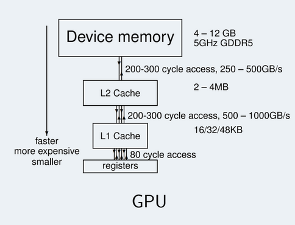
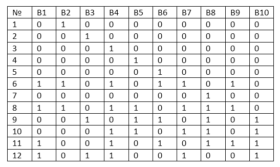

# Shared memory

Едем дальше. Необычные принципы работы с памятью мы вспомнили выше, теперь подумаем над чуть другой задачей.

Итак, если для задачи сложить два массива было довольно очевидно, как это сделать, то что будем делать с задачей суммы на массиве? Или ещё лучше - найти произведение матриц, где приходится искать скалярное произведение каких-то случайно лежащих элементов в первых 2 матрицах. Ответ - лень думать.

Давайте вместо этого используем L1 кэш видеокарты. Кстати, у неё 2 кэша, но если ко второму мы не имеем доступ, то с первым неожиданно (в отличие от CPU) всё хорошо.

В общем, для начала смотрите:



Здесь схематично показаны скорости соединений между разными уровнями памяти GPU. Как видим, тот путь, который мы вечно просили проделывать всем данным шёл из Device memory до регистров микроядер. И составлял он в среднем около 500-600 тактов времени. Да и ширина шины памяти довольно не большая, из-за чего скорость получаем совсем маленькую.

А вот если смотреть с L1 кэша, то тут уже пободрее. 80 тактов на доступ, а скорости исчисляем в терабайтах. Более того, нам больше не надо париться, что данные приходят по блокам в 32 float или int! Теперь стучим куда пожелаем! Хотя....

Так вот, как я уже говорил, мы можем напрямую управлять L1 памятью. Однако, как обычно тут есть пара загвоздок.

- L1 память у каждого SM процессора своя и никак не пересекается с памятью соседнего (в принципе у ядер процессоров в последнее время так же). А это значит, что каждый блок будет видеть и использовать только свою L1 память (помните же, что один блок задач ложиться ровно на один SM процессор?)
- L1 память организована с матричным доступом по машинным словам (слово, это 128 байт, но в примере только 10 ячеек). Что это значит? Нууу, представим большой склад, шириной 32 секции и длинной... около 2'000 секций. Да, по факту очень вытянутый в длину склад. Так вот, для работы с этим складом у нас есть только 32 клешни, каждая катается по своим рельсам, расположенным вдоль склада на 2'000 метров. То есть в один момент времени нам могут подвезти только 32 ячейки данных, каждая из которых лежала под своим рельсом.



В общем, если 2 потока попытаются прочитать данные из 1го слова B3 ячейки и 3го слова B3 ячейки, то им придётся ждать 2 итерации передачи данных, так как клешне придётся 2 раза отправиться за данными. А вот если стучаться в B3 ячейку и B6 ячейку, даже с учётом, что они стоят не в одной сроке, то операция чтения будет одна и данные придут одновременно. В принципе всё, осталось только понять, как проектировать алгоритмы, что бы процесс чтения и записи данных действительно был быстрым и не мешал друг другу.

### Попытка один

Для начала надо придумать код с обращением к глобальной памяти, где кэширование имело бы смысл. Для примера - просто возьмём массив и сложим в нём все парные элементы. То есть 1ый со 2ым и запишем в 1ый, 2ой с 3им и запишем во 2ой и так далее. По математически - `x[i] = x[i] + x[i+1]`. **Для упражнения крайне рекомендую самим написать код и main и ядра для такой задачи**, но в целом код написан ниже:

```c++
#include <iostream>
#include <cmath>
#include <cassert>

#define BLOCKSIZE 256

__global__ void Difference(int n, int* input, int* result) {
    int tid = blockDim.x * blockIdx.x + threadIdx.x;
    int x_i = input[tid];
    
    if (tid > 3) {
        for (int i = 0; i < 4; i++)
            result[tid] = input [tid] + input[tid - i];
    } else {
        result[tid] = x_i;
    }
}


int main() {
    int N = 1 << 28;
    cudaSetDevice (5);

    int* h_array = new int[N];
    int* h_diff = new int[N];
    for (int i = 0; i < N; ++i) {
        h_array[i] = 1;
    }
    
    int* d_array;
    int* d_diff;
    unsigned int size = N * sizeof(int);
    cudaMalloc(&d_array, size);
    cudaMalloc(&d_diff, size);

    cudaMemcpy(d_array, h_array, size, cudaMemcpyHostToDevice);
    
    int num_blocks = (N + BLOCKSIZE - 1) / BLOCKSIZE;

    cudaEvent_t start, stop;

    cudaEventCreate(&start);
    cudaEventCreate(&stop);

    cudaEventRecord(start);
    Difference<<<num_blocks, BLOCKSIZE>>>(N, d_array, d_diff);
    cudaEventRecord(stop);


    cudaMemcpy(h_diff, d_diff, size, cudaMemcpyDeviceToHost);

    float milliseconds;
    cudaEventSynchronize(stop);


    cudaEventElapsedTime(&milliseconds, start, stop);

    for (int i = 10; i < N; ++i) {
        //std::cout << h_diff[i];
        assert(h_diff[i] == 2);
    }

    std::cout << milliseconds << " elapsed" << std::endl;

    cudaEventDestroy(start);
    cudaEventDestroy(stop);
    cudaFree(d_array);
    cudaFree(d_diff);
    delete[] h_array;
    delete[] h_diff;
}
```
[Оригинал](https://github.com/akhtyamovpavel/ParallelComputationExamples/blob/master/CUDA/03-memory-model/02-shared/global_example.cu)

Здесь код приведён с небольшим "усложнителем" в виде бесполезного цикла на 4, чтобы разница была видна более явно. В результате всё равно будет записано число 2 (надеюсь, сможете сами осознать почему, тоже как упражнение). В общем пробуем, смотрим сколько времени и думаем над оптимизацией. Должно получиться примерно 5 мс. Теперь попробуем добавить shared память

### Вторая попытка, с shared памятью

Как обычно, основной код main мы не трогаем и всё что нужно потыкать - это ядро. Для начала про главную магию

- `__shared__`   - ключевое слово, которая указывает, что данную переменную или массив нужно хранить на L1 кэше, а не в глобальной памяти. И естественно, её ещё и инициализировать нужно отдельно. И ещё хуже - перед её использованием, если бы будем работать не только с той ячейкой, к которой обратились (хотя тогда смысл теряется), то нужно ещё заставить SM процессор дождаться, пока вся shared память всеми микроядрами будет приведена к нужному виду. Короче, вызвать `__syncthreads()`.

Первоначальный план таков - мы запишем данные для текущей ячейки в shared память, дождёмся записи, а потом будем в лоб брать сумму ещё со следующей ячейкой, в которой так же лежат полезные данные. Главное уточнение только не забудьте - **shared память существует только в рамках одного блока**. То есть, если процесс находится уже в другом блоке, он не сможет обратиться к памяти предыдущего!!! У него она будет своя

В общем, давайте пробовать

```c++
__global__ void Difference(int n, int* input, int* result) {
    int tid = blockDim.x * blockIdx.x + threadIdx.x;
    __shared__ int s_data[BLOCKSIZE]; // создаём shared память на блок

    s_data[threadIdx.x] = input[tid];// Заполняем её

    __syncthreads();// Ждём, чтобы точно все ячейки заполнились правильно

    if (threadIdx.x > 3) { // Локальное условие - проверяем, что мы не на границе блока, и что к предыдущему элементу можно обратиться через shared память. Иначе пойдём в глобальную
        for (int i = 0; i < 4; i++) // Искусственное усложнение циклом, как и в прошлый раз, можно в принципе выкинуть его
            result[tid] = s_data[threadIdx.x] + s_data[threadIdx.x - i];
    } else if (tid > 3) {// Глобальное условие - суммировать текущую ячейку с предыдущей можно только, если предыдущая в принципе существует
        for (int i = 0; i < 4; i++)
            result[tid] = s_data[threadIdx.x] + input[tid - i];
    } else {// Если для текущей ячейки нет предыдущих в принципе, то просто оставляем её такой же (типа начальное условие)
        result[tid] = input[tid];
    }
}
```

[Оригинал](https://github.com/akhtyamovpavel/ParallelComputationExamples/blob/master/CUDA/03-memory-model/02-shared/shared_example.cu)

Пробуем теперь запускать и получаем.... ускорение примерно на 20%. Ну, в принципе очень даже не плохо. Разница между 20 и 25 фпс вполне ощутимая вещь, так что полезно. Хотя, на самом деле, для большего ощущения ускорения нужно гораздо больше работы с памятью, чем здесь. И для этого мы на следующий раз оставим на закуску задачу Reduce и Scan. Ну или суммирование массива и построение массива частичных сумм соответственно.


---


# Reduce и Scan

## Reduce

Что-ж, на прошлом занятии мы обсудили небольшую магию про shared память. Однако, в целом так и не добились сильного прироста производительности за её счёт. Пора разобраться с этой проблемой!

Задача `Reduce` - задача подсчёта суммы на всём массиве. Самый в лоб вариант - каждому потоку отдать свой непрерывный кусочек массива, который он и будет подсчитывать. А потом так же просуммировать результаты. Однако, я думаю вы сами понимаете, что в таком случае можно забыть напрочь о деление на блоки и оптимизации работы с памятью, поэтому мы сделаем по другому - будем вычислять суммы внутри блоков.

### Первичная идея

Итак, как можно подсчитать сумму внутри блока, зная, что у нас много потоков, вплоть до того, что на каждую ячейку есть по одному потоку? Ну, первая мысль, которая приходит по аналогии с CPU, взять каждый поток и отдать ему кусочек блока. А давайте так и попробуем.

