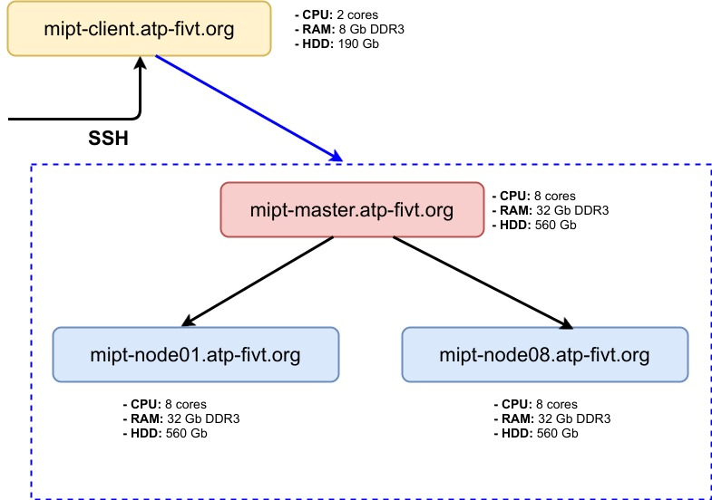

## Семинар: HDFS ##

### Структура кластера и роли серверов ###
Кластер:



Клиентская машина:

    mipt-client.atp-fivt.org

На клиентскую машину заходим по ssh, только с нее есть доступ к кластеру. На сервера кластера по ssh в обычной жизни не ходим, работаем с кластером клиентскими утилитами (hdfs, yarn, hadoop).

Но мы в учебных целях будем ходить на ноды, чтобы посмотреть как там устроено хранение. Для этого есть специальный юзер:

    login: hdfsuser
    password: hdfsuser

Зайти на любую датаноду, например на mipt-node08, можно командой:

	$ sudo -u hdfsuser ssh hdfsuser@mipt-node08.atp-fivt.org


### Основные команды ###

Зайти на клиентский сервер. Рассмотрим команды:

* Содержимое директорий:

  	$ hdfs dfs -ls /
  		$ hdfs dfs -ls .
  		$ hdfs dfs -ls 

  последние 2 эквивалентны и относятся к домашней директории; показать, где находится домашняя директория в hdfs `(/user/...)`

* Создать директорию, загрузить в нее какой-нибудь текстовый файл:

  	$ hdfs dfs -mkdir <dir>
  	$ hdfs dfs -put <local_file> <hdfs_file>
  	$ hdfs dfs -cat <file>
  В последней можно поменять -cat на -text. `-text` распознает кодировку и декодирует файл. `-cat` этого не умеет (это нам понадобится когда будет работать с OutputFormat'ами в MapReduce).
  Создать файл README:

  	$ echo "read it" > README
  	$ echo "read it again" >> README
  	$ cat README
  Загрузить его в HDFS, распечатать оттуда с помощью (-cat)

* Переименование и копирование:

  	$ hdfs dfs -mv <file1> <file2>
  	$ hdfs dfs -cp <file1> <file2>
  Важно: копирование идет через клиента, для избежания этого или копирования вообще между кластерами есть команда hadoop distcp

* Исследовать директорию /data

  	$ hdfs dfs -ls /data
  Вывести на экран часть какого-нибудь файла с помощью more (less) и head. Например, 2 первые строки из файла с Википедией:

  	$ hdfs dfs -cat /data/wiki/en_articles/articles | head -2
  	$ hdfs dfs -tail /data/wiki/en_articles/articles

Есть ли идеи почему в HDFS сделали -tail, но не сделали -head?

* Объяснить вывод команды ls, например:

  	$ hdfs dfs -ls /data/wiki/en_articles
  	Found 1 items
  	-rw-r--r--   3 hdfs supergroup 12328051927 2017-07-03 23:21 /data/wiki/en_articles/articles
  выводит пермиссии, число реплик, пользователя, группу, размер, время модификации. Посмотреть, что это совпадает со справкой в

  	$ hdfs dfs -help

* Сколько места занимают файлы и директории, например:

  	$ hdfs dfs -du -h /data/wiki
        11.5 G  34.4 G   /data/wiki/en_articles
  выводит размер и занимаемое место. Последнее учитывает фактор репликации (3 по умолчанию, 2 в нашем случае)

* Изменить фактор репликации:

  	$ hdfs dfs -setrep <path>
  Посмотреть на эффект с помощью ls.
  (ставим флаг `-w` если хотим дождаться завершения команды, а не выполнять в фоновом режиме)

* Удалить файл:

  	$ hdfs dfs -rm <file>
или директорию

		$ hdfs dfs -rm -r <file> 

При удалении файл перемещается в корзину (~/.Trash). При этом в корзине воссоздаётся абсолютный путь к файлу (`.../.Trash/user/your_user/your_dir/your_file`). Для удаления в обход корзины используйте флаг `--skipTrash`.

Остальные команды: -help

### Веб-интерфейс Namenode ###

Зайти на [http://mipt-master.atp-fivt.org:50070](http://mipt-master.atp-fivt.org:50070)

Если доступа нет, пробросить порт 50070:

	$ ssh -L 50070:mipt-master.atp-fivt.org:50070 MY_USER@mipt-client.atp-fivt.org  # вместо MY_USER введите свой логин (`par***`)
Тогда пока сессия ssh открыта, интерфейс будет тут: [http://localhost:50070](http://localhost:50070)

Показать:

- Heap memory used/total - сколько памяти на NN и насколько занята. Сильно занята - проблемы.
- Capacity - сколько всего места в DFS
- DFS Used - сколько занято
- Live nodes - сколько живых датанод и насколько заполнены
- Utilities -> Browse the Filesystem

### Структура хранения в HDFS ###
#### HDFS fsck ####

Посмотреть, на какие блоки разбит файл, какого они размера, их идентификаторы, где они расположены:

	$ hdfs fsck /data/wiki/en_articles_part -files -blocks -locations

Посмотреть информацию по одному блоку, например:

	$ hdfs fsck -blockId blk_1073971176

#### WebHDFS REST API ####

Открыть файл на чтение, получив редирект на нужныю датаноду. Выполняет команду на сервере:

	$ curl -i "http://mipt-master.atp-fivt.org:50070/webhdfs/v1/data/wiki/en_articles_part/articles-part?op=OPEN"

Из результата предыдущей команды взять Location, добавить &length=100 - получить 100 первых символов файла.

Подробнее: http://hadoop.apache.org/docs/r1.2.1/webhdfs.html

#### Java API

Пример: вывести top-5 строк датасета, который лежит в HDFS (путь к директории передается через args).

```java
public class OutputTopAndDelete {

    public static void main(String[] args) throws IOException {
        Path outPath = new Path(args[0]); // путь - аргумент командной строки
        FileSystem fs = FileSystem.get(new Configuration()); // Configuration - свойства файловой системы
        int top = 5; // хотим вывести 5 строк
        if(!fs.exists(outPath)){  // есть ли файл?
            System.err.println("Incorrect path!");
            return;
        }
        outTop(fs, outPath, top);
        fs.deleteOnExit(outPath); // удаляем данные перед выходом (вернемся к этому на семинаре по MapReduce)
    }

    /**
     * Вывести ТОП-N строк в директори HDFS. Полезно в том случае если нужно вывести ТОП по отсортированным данным.
     */
    private static void outTop(FileSystem fs, Path path, int top) throws IOException {
        int linesCount = 0;
        for (FileStatus status: fs.listStatus(path)){ //FileStatus описывает файл (или директорию) в HDFS (путь, время создания, права...)
            BufferedReader br = new BufferedReader(new InputStreamReader(fs.open(status.getPath())));
            String line = null;
            // читаем построчно пока не наберется топ
            while ((line = br.readLine()) != null && linesCount < top){
                System.out.println(line);
                linesCount++;
            }
        }
    }
}

```

* Сборка кода через Maven.
* Запуск: `hadoop jar <JAR> [args]` (см. файл `run.sh`).

Полный код Java-проекта в [папке](https://gitlab.com/pd2020-supplementary/8xx-GLOBAL/-/tree/master/practice/code/hdfs_example).

#### Python API
Прежде чем начать работу, нужно настроить окружение.

1. Создаём файл ~/.hdfscli.cfg
2. Пишем в него конфигурацию файловой системы:
```
[global]
default.alias = default

[default.alias]
url = http://mipt-master.atp-fivt.org:50070
user = <my_user> # например, velkerr
```

3. Теперь можем пользоваться API.
```python
>>> from hdfs import Config
>>> client = Config().get_client()
>>> client.list('/data')
['MobodMovieLens', 'access_logs', 'course4' ... ]
```

[Больше примеров](https://hdfscli.readthedocs.io/en/latest/quickstart.html#reading-and-writing-files)
* чтение,
* запись,
* скачивание и закачивание из локальной ФС

Получение статуса файла (аналог FileStatus в Java API).
```python
>>> client.status('/data/wiki')
{'accessTime': 0, 'length': 0, ...}
```

Ещё библиотеки на Python: hadoopy pydoop dumbo mrjob .

### Оценка характеристик кластера ###

**Задача 1:**
Для HDFS ёмкостью 2PB c размером блока 64MB и фактором репликации 3 оценить минимальный объем RAM на Namenode. Считаем, что метаинформация о каждом блоке (независимо от числа реплик) занимает в памяти NameNode 600B.

**Решение:**
2PB / 64MB - число блоков.

Разных блоков будет: 2PB / 64MB / 3

Требуемая память:
(2PB / 64MB / 3) * 600B = 6.25GB


**Задача 2:**
На кластере используются HDD с характеристиками: seek time - 12мс, скорость линейного чтения - 210 MB/c. Какой минимальный размер блока в HDFS стоит выбрать, чтобы время поиска блока составляло не больше 0.5% от времени чтения блока?

**Решение:**
0.5% от времени чтения блока размера Х должен быть не меньше 12мс:

X / 210 MB/c * 0.005 >= 0.012 c

X >= 0.012 * 210 / 0.005 = 504 MB

### Обёртка над HDFS shell

Стандартный HDFS shell.
* не хранит состояние
* на каждую команду стартует своя Java Virtual Machine,
* нет автоподстановки,
* нельзя сменить пользователя (su ...).

В 2017 г. в Avast разработали обрёртку над HDFS shell: https://github.com/avast/hdfs-shell .
Написана на Java, но с точки зрения пользователя - bash.

Простая установка:
* качаем бинарник (напр., wget'ом),
* разрахивируем (unzip), добавляем ./libs в CLASSPATH
* заходим в hdfs-shell-1.0.7/bin
* запускаем hdfs-shell.sh.

На кластере оболочка установлена, просто запустите `hdfs-shell`.

Pros.
* Cокращённые названия команд (например, ls, а не hdfs dfs -ls). Подробнее - выполните help.
* Есть автоподстановка,
* Есть дополнительные команды, которые есть в bash, но нет в HDFS shell (напр., pwd, groups).
* Можно создавать свои команды и встраивать их в обёртку.

Cons.
* Нельзя выполнять цепочки команд (например, ls -l | grep ).
* Через `su` можно сменить пользователя без авторизации => небезопасно.

### Apache Hue (hadoop user experience)
1. Пробрасываем порт `8888:mipt-node03:8888`
2. Пользователь `hue_user`, пароль `hue_password`

### Тестирующая система для сдачи ДЗ ###

* У вас есть репозиторий `<ФИО>-demo`, в нём ветка demotask1. Такой вид будут иметь ваши репозитории для сдачи заданий.
* Скачайте файлы из репозитория http://gitlab2.atp-fivt.org/root/demos (это WordCount - программа для подсчёта слов на MapReduce) и закоммитьте в ветку demotask1 своего репозитория (см. выше)
* Смотрим на pipeline и на логи тестирующей системы.
* Теперь внесём баг в нашу программу. Заменим число 1 на 2 последней строке маппера.
* Коммитим, пушим, снова смотрим на вывод системы. Видим failed-тесты.

[Подробнее](https://docs.google.com/presentation/d/1eDxnTeBWSB1OrA3BwEUa2vJAJm3_OJMuoRxyA13RzTY/edit#slide=id.p)
