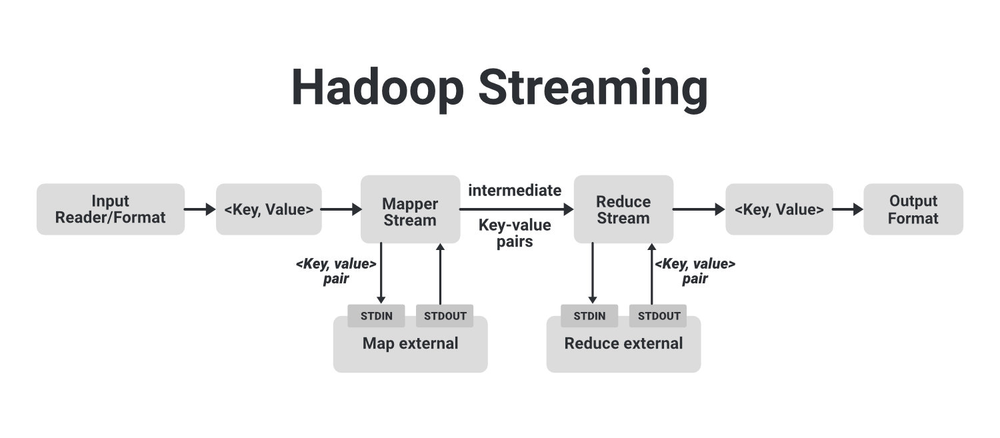

# Семинар №9

---

## Hadoop MapReduce Basics

---

[Неплохой туториал по экосистеме Hadoop от рядового пользователя](https://techvidvan.com/tutorials/hadoop-mapreduce-tutorial/)

---

### Начнем с практики теоретического решения некоторых задач в терминах MapReduce

* Посчитать количество слов в тексте, в которых гласных не меньше согласных.
<details><summary>Решение</summary>
<code>
Mapper : line -> [(null, 1) for word in line if num_vowels(word) >= num_consonants(word)]
</code>
<br/>
<code>
Reducer: (null, [1 ... 1]) –> (null, SumOver1)
</code>
</details>

* Узнать топ-10 самых популярных слов в тексте, в которых гласных не меньше согласных. Посчитать долю этих слов среди всех слов и среди тех, в которых гласных не меньше согласных.
<details><summary>Решение</summary>
<code>
Mapper1 : line -> [(null, (num_vowels(word) >= num_consonants(word) ? 1 : 0, 0)) for word in line]
</code>
<br/>
<code>
Reducer1: (null, [(v0, 1), (v1, 1), ...]) –> (null, (SumOverV, SumOverAll))
</code>
<br/>
<code>
Mapper2 : line -> [(word, 1) for word in line if num_vowels(word) >= num_consonants(word)]
</code>
<br/>
<code>
Reducer2: (word, [1 ... 1]) –> (word, SumOver1) [and order the result by SumOver1 desc]
</code>
<br/>
<code>
Mapper3 : (word, (SumOver1)) –> (word, (SumOver1 / SumOverV, SumOver1 / SumOverAll))
</code>
</details>

* Пусть в нашей базе есть табличка/коллекция `users`, элементы которой в текстовом формате имеют следующий вид (хранятся построчно):
```json
{ name: "Vasya", age: 22, interests: ["football", "IT", "Ps4"], avgSalary: 7500.0 }
{ name: "Angela", age: 17, interests : ["xbox", "ps4", "fitness"], avgSalary: 14123 }
{ name: "Misha", age: 23, interests : ["food", "money"], avgSalary: 4000 }
```
Для формирования новогодней акции в интернет-магазине необходимо провести исследование среди
пользователей: посчитать средний возраст и среднюю заработную плату пользователей среди топ-20 популярных интересов
(т.e. для популярных интересов посчитать метрики по пользователям).  
Гарантируется уникальность пользователей.
<details><summary>Решение</summary>
<code>
Mapper1 : line -> [..., (obj["interests"][i], (1, obj["age"], obj["avgSalary"])), ...] where obj = Serialize(line)
</code>
<br/>
<code>
Reducer1: (interest, [(age, salary, 1), ...]) -> (interest, (Avg(age), Avg(salary), num=SumOver(1)))
 [and order the result by num desc]
</code>
<br/>
<code>
Print first 20 lines
</code>
</details>

* В реальном мире данные из предыдущего примера не такие чистые, т.e. любое поле (кроме `name`) может быть `null'овым`,
  поле `interests` может содержать дубли, может быть кривая кодировка. Как изменится решение в таком случае?
<details><summary>Решение</summary>
Здесь есть несколько вариантов решения. Предложу один возможный из них. 
Отбрасываем объекты, которые не содержат поле "interest". Далее необходимо модифицировать маппер и редьюсер.
<br/>
<code>
Mapper1 : line -> [..., (obj["interests"][i], (1, obj["age"] ? 1 : 0, obj["age"] or 0, obj["avgSalary"] ? 1 : 0, obj["avgSalary"] or 0)), ...] where obj = Serialize(line)
</code>
<br/>
<code>
Reducer1: (interest, [(1, isNotNullAge, age, isNotNullSalary, salary), ...]) -> (interest, (num=SumOver(1), SumOver(isNotNullAge), SumOver(age), SumOver(isNotNullSalary), SumOver(salary))) [and order the result by num desc]
</code>
<br/>
<code>
Mapper2 : (interest, (num, SumOver(isNotNullAge), SumOver(age), SumOver(isNotNullSalary), SumOver(salary))) -> (interest, (SumOver(age) / SumOver(isNotNullAge), SumOver(salary) / SumOver(isNotNullSalary)))
</code>
</details>

### Hadoop MapReduce Streaming
[Немного про отладку Hadoop Streaming](https://gitlab.com/fpmi-atp/pd2021-supplementary/global/-/blob/master/materials/08-mapreduce_part1.md#2-%D0%BE%D1%82%D0%BB%D0%B0%D0%B4%D0%BA%D0%B0-mapreduce-%D0%B7%D0%B0%D0%B4%D0%B0%D1%87)
[Полная документация здесь](https://hadoop.apache.org/docs/r1.2.1/streaming.html)

И mapper, и reducer - это исполняемые файлы, которые считывают входные данные из `stdin` (строка за строкой) и отправляют выходные данные в `stdout`. 
Jar-файл ("архив" с инструментами Hadoop Streaming) `hadoop-streaming.jar` создаст MapReduce джобу и отправит ее на исполнение в кластер.



Если для mapper'a указан исполняемый файл, каждая задача mapper'a запускает исполняемый файл как отдельный процесс при инициализации. 
По мере выполнения стадии Map, происходит преобразование строк из stdin в строки stdout, которые в свою очередь 
трансформируются в пару ключ/значение. По умолчанию префикс строки до первого символа табуляции является ключом, а остальная часть строки (за исключением символа табуляции) будет значением. Если в строке нет символа табуляции, то вся строка считается ключем и значение равно нулю. Однако это можно настроить (это сделать будет описано ниже).

Каждая задача Reduce запускает исполняемый файл как отдельный процесс, после чего reducer инициализируется. 
По мере выполнения стадии Reduce, происходит преобразование пары ключ/значение в строки и передает строки в stdin.
Reducer собирает линейно-ориентированные выходные данные из стандартного вывода процесса, преобразует каждую строку в пару ключ/значение, которая отправляется на `stdout` reducer'a. 
Разделение на ключ/значение аналогично для стадии Map.

`DistributedCache` - это средство, предоставляемое фреймворком Hadoop MapReduce для кэширования файлов (текста, архивов, jar-файлов и т.д.), необходимых для приложения.
С пользовательской точки зрения это просто "небольшое" по размеру хранилище, по умолчанию размер DC 10 GB. Размер можно модифицировать параметром **local.cache.size**.

Запуск MapReduce таски из консоли выглядит примерно так:
```shell
$HADOOP_HOME/bin/hadoop  jar $HADOOP_HOME/hadoop-streaming.jar \
    -<GENERIC_PARAMETER_OPTION> <GENERIC_PARAMETER_VALUE> \
    ...
    -<STREAMING_PARAMETER_OPTION> <STREAMING_PARAMETER_VALUE> \
    ...
```
или при запуске через YARN:
```shell
yarn jar $HADOOP_HOME/hadoop-streaming.jar \
    -<GENERIC_PARAMETER_OPTION> <GENERIC_PARAMETER_VALUE> \
    ...
    -<STREAMING_PARAMETER_OPTION> <STREAMING_PARAMETER_VALUE> \
    ...
```
в рамках нашого курса это:
```shell
yarn jar /opt/cloudera/parcels/CDH/lib/hadoop-mapreduce/hadoop-streaming.jar \ 
    -<GENERIC_PARAMETER_OPTION> <GENERIC_PARAMETER_VALUE> \
    ...
    -<STREAMING_PARAMETER_OPTION> <STREAMING_PARAMETER_VALUE> \
    ...
```

Полный список общих параметров:

| Параметр                          | Optional/Required	| Описание |
| ---------------------------------- |:------------------:| :-----|
| -conf configuration_file | Optional	 | Путь к конфигурационному файлу |
| -D property=value            | Optional	 |  |
| -fs host:port or local | Optional	 | Неймнода |
| -jt host:port or local | Optional	 | Джобтрекер |
| -files | Optional	 | Specify comma-separated files to be copied to the Map/Reduce cluster |
| -libjars | Optional	 | Specify comma-separated jar files to include in the classpath |
| -archives | Optional  | Specify comma-separated archives to be unarchived on the compute machines |

Например, Map-only таска может быть запущена так:
```shell
yarn jar /opt/cloudera/parcels/CDH/lib/hadoop-mapreduce/hadoop-streaming.jar \
    ...
    -D mapred.reduce.tasks=0
    ...
```

Полный список параметров для стриминга:

| Параметр                          | Optional/Required	| Описание |
| ---------------------------------- |:------------------:| :-----|
| -input (directoryname or filename) | Required | Путь к входящим данным в маппер |
| -output (directoryname)            | Required | Путь к выводу редьюсера |
| -mapper (executable or JavaClassName) | Required | Сам маппер |
| -reducer (executable or JavaClassName) | Required | Сам редьюсер |
| -file (filename) | Optional | Какие файлы будут помещены в `Distributed Cache` (executable mapper, executable reducer, ...) |
| -inputformat (JavaClassName) | Optional | Определяет парсинг входных данных, TextInputFormat is used as the default |
| -outputformat (JavaClassName) | Optional | Определяет парсинг выходных данных, TextOutputformat is used as the default |
| -partitioner (JavaClassName) | Optional | Определяет как распределять ключи по редьюсерам |
| -combiner (streamingCommand or JavaClassName) | Optional | Комбайнер |
| -cmdenv (`<name>=<value>`) | Optional | Проброс переменных окружения |
| -verbose | Optional |  |
| -numReduceTasks | Optional | Количество редьюсеров |
| -mapdebug (executable or JavaClassName) | Optional | Что будет вызвано, если Map fails |
| -reducedebug (executable or JavaClassName) | Optional | Что будет вызвано, если Reduce fails |

Например, следующий запуск будет валиден в рамках Hadoop Streaming:
```shell
yarn jar /opt/cloudera/parcels/CDH/lib/hadoop-mapreduce/hadoop-streaming.jar \
    -input ${INPUT_DIR} \
    -output ${OUTPUT_DIR} \
    -mapper /bin/cat \
    -reducer /bin/wc
```
что эквивалентно
```shell
yarn jar /opt/cloudera/parcels/CDH/lib/hadoop-mapreduce/hadoop-streaming.jar \
    -input ${INPUT_DIR} \
    -output ${OUTPUT_DIR} \
    -mapper org.apache.hadoop.mapred.lib.IdentityMapper \
    -reducer /bin/wc
```

Про возможности YARN лучше всего прочитать в самой [документации](https://hadoop.apache.org/docs/r2.8.5/hadoop-yarn/hadoop-yarn-site/YarnCommands.html#application).

См. пример в `examples/00-word-count`.
```shell
#!/bin/bash

OUT_DIR="streaming_wc_result"
NUM_REDUCERS=8

hadoop fs -rm -r -skipTrash $OUT_DIR*  # удаляем результаты предыдущего запуска (HDFS не перезаписывает данные поэтому без удаления выдаст ошибку о том, что путь занят).

yarn jar /opt/cloudera/parcels/CDH/lib/hadoop-mapreduce/hadoop-streaming.jar \  # подключаем jar-файл с инструментами Hadoop Streaming
    -D mapred.job.name="my_wordcout_example" \  # задаем имя нашей джобе
    -D mapreduce.job.reduces=${NUM_REDUCERS} \  # устанавливаем кол-во reducer'ов в задаче
    -files mapper.py,reducer.py \  # добавляем файлы в distributed cache чтоб каждая нода имела к ним доступ
    -mapper mapper.py \  # для такой записи файлы должны быть исполняемыми
    -reducer reducer.py \  # в противном случае пишем `python mapper.py`, `bash mapper.py` в зависимости о того, на чём написан код.
    -input /data/wiki/en_articles_part \  # входны и выходные данные
    -output $OUT_DIR # относительный путь (= /user/par2018XX/${OUT_DIR})

# Проверка результата.
# Каждый reducer генерирует вывод в свой файл. Файлы имеют вид `part-XXXXX`.
for num in `seq 0 $(($NUM_REDUCERS - 1))`
do
    hdfs dfs -cat ${OUT_DIR}/part-0000$num | head  # Выводим 1-е 10 строк из каждого файла. 
done
```

При теоретическом разборе мы решали задачки не в один проход Map/Reduce, т.е. в несколько джоб.
Для практической реализации требуется написать несколько мапперов, редьюсеров и последовательно запустить их как
отдельные джобы.

Пример использования `Distributed Cache` можно посмотреть в примере `examples/01-stop-words`.

#### Счетчики

После выполнения таски в MapReduce, можно увидеть счетчики. 
Эти счетчики в Hadoop MapReduce предоставляют большой объем статистической информации о выполненном таски. 
Помимо предоставления информации о задачах, эти счетчики также помогают диагностировать проблемы, поиск узких горлых и 
в редких случаях заменить стадию Reduce, например посчитать общее количество записей/посчитать количество упавших строк с
парсингом.
  
В Hadoop Streaming реализовать счетчики довольно просто:
```shell
A streaming process can use the stderr to emit counter information. reporter:counter:<group>,<counter>,<amount> should be sent to stderr to update the counter.
```
Т.е. достаточно написать в стандартных поток ошибок сообщение формата: `reporter:counter:<group>,<counter>,<amount>`.  
См. пример в `examples/02-stop-words-counters`.  
  
Ранее оговаривалось, что Streaming не завязан на конкретном языке программирования. Пример `examples/04-pi-monte-carlo` 
показывает, что помимо привычных нам Java и Python можно использовать С/С++. Сам пример реализует метод Монте-Карло для 
подсчета числа пи: значения из группы счетчиков `Monte Carlo` надо разделить друг на друга и в ответе получить число, приближенное к `пи / 4`:
```shell
        Monte Carlo
                Inside points=15564
                Total points=20000
```

### Hadoop MapReduce Java API

[Общий ридинг](https://gitlab.com/fpmi-atp/pd2021-supplementary/global/-/blob/master/materials/09-mapreduce_part2.md#hadoop-java-api)

[Документация](https://hadoop.apache.org/docs/stable/hadoop-mapreduce-client/hadoop-mapreduce-client-core/MapReduceTutorial.html)